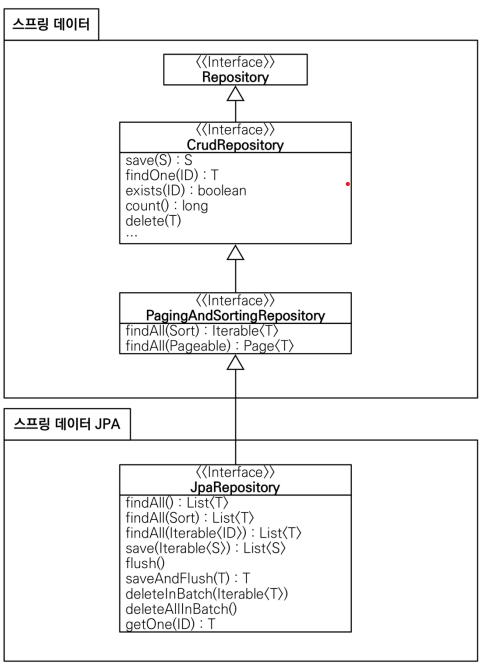

## 10일차 공부(2022.06.27)

# JPA
## 1. 특징
#### (1) Connection, PreparedStatement, Resultset 등 반복 코드는 물론이고, 기본적인 SQL까지 JPA가 직접 만들어서 실행해줌
#### (2) SQL과 데이터 중심의 설계에서 객체 중심의 설계로 패러다임을 전환 할 수 있다.
#### (3) 개발 생산성을 크게 향상된다.
#### (4) JPA는 자바 표준 인터페이스이고, 구현체는 Hibernate등등의 vendor들이 있음.
#### (5) JPA를 Spring에서 한번 감싸서 제공하는게 Spring Data JPA임.


## 1. 초기 설정

### 1. build.gradle에 jpa추가

```java
implementation 'org.springframework.boot:spring-boot-starter-data-jpa'
```

### 2. resources/application.properties
```java
spring.jpa.show-sql=true  //jpa가 날리는 sql을 볼 수 있게 함.
spring.jpa.hibernate.ddl-auto=none //jpa를 사용하면 객체를 보고 자동으로 테이블을 만들어주는데 그 기능을 끄려면 none하면 됨. 자동 생성하려면 create로 설정
```

## 2. Example

###  1. Member.class
```java
@Entity
public class Member {
    @Id @GeneratedValue(strategy = GenerationType.IDENTITY)
    private Long id;
    @Column(name="username")
    private String name;
}
```

> #### ORM(Object Relational db Mapping)을 하기 위해서 **@Entity**를 도메인 클래스에 붙여주면 JPA가 Entity로써 관리해줌. 
> #### 그리고 pk를 지정해줘야 하는데 DB가 자동으로 1씩 늘어나는 키를 부여하도록 하고 싶으면 @GeneratedValue에 IDENTITY전략을 설정해줘야 함.
<br/>

### 2. MemberRepository.class
```java
public class JpaMemberRepository implements MemberRepository{

    private final EntityManager em;

    public JpaMemberRepository(EntityManager em) {
        this.em = em;
    }

}
```
>#### JPA는 **EntityManager**를 통해서 모든게 동작하게 됨.
>#### 따라서 JPA를 쓰려면 EntityManager를 주입받아야 함.
>#### 아까 위에서 JPA 라이브러리를 Dependencies에 추가했는데 그러면 spring boot가 자동으로 EntityManager를 현재 db와 연결해서 자동으로 만들어줌.
>#### EntityManager 내부에서 DataSource를 가지고 있어서 db와 연결하고 하는 과정 등을 처리해준다.
<br/>

```java
    @Override
    public Member save(Member member) {
        em.persist(member);
        return member;
    }

    @Override
    public Optional<Member> findById(Long id) {
        Member member = em.find(Member.class, id);
        return Optional.ofNullable(member);
    }

    @Override
    public Optional<Member> findByName(String name) {
        List<Member> result = em.createQuery("select m from Member m where m.name = :name", Member.class)
                .setParameter("name", name)
                .getResultList();

        return result.stream().findAny();
    }

    @Override
    public List<Member> findAll() {

        return em.createQuery("select m from Member m", Member.class)
                .getResultList();
    }
```
> #### 이제 EntityManager를 통하여 insert의 경우 persist메서드를 사용하면 내부에서 쿼리를 다 작성해서 보내준다!!😲
> #### JPQL을 사용하여 쿼리를 생성해야할 때도 있다.
> #### Spring Data JPA를 사용하면 JPQL을 짤 필요가 없다.
<br/>

### 3. MemberService.class
```java
@Transactional
public class MemberService {

    private final MemberRepository memberRepository;

    public MemberService(MemberRepository memberRepository) {
        this.memberRepository = memberRepository;
    }
...
}
```
> #### 데이터를 저장하거나 변경할 때는 항상 트랜잭션이 있어야 하므로 @Transaction을 클래스나 아니면 트랜잭션이 필요한 메서드에 붙여준다.

### 4. SpringConfig.class
```java
@Configuration
public class SpringConfig {

    private EntityManager em;

    @Autowired
    public SpringConfig(EntityManager em) {
        this.em = em;
    }

    @Bean
    public MemberService memberService(){
        return new MemberService(memberRepository());
    }

    @Bean
    public MemberRepository memberRepository(){
        return new JpaMemberRepository(em);
    }
}
```
>#### EntityManager를 Autowired로 자동 주입받고 Repository로 넘겨준다.
<br/>
<br/>

# Spring Data JPA
#### 위에서 JPA를 사용해봤는데 코드가 이전에 비해 확 줄어든걸 체감할 수 있었다.
#### 그런데 Spring Data JPA를 사용하면 Repository에 구현 클래스 없이 인터페이스 만으로 개발을 할 수 있고 기본 CRUD 기능도 모두 제공해준다고 한다. 이제 알아보자!

## 1. Example

### 1. SpringDataJpaMemberRepository.interface
```java
public interface SpringDataJpaMemberRepository extends JpaRepository<Member, Long>, MemberRepository {

    @Override
    Optional<Member> findByName(String name);
}
```
>#### 이런식으로 인터페이스 Repository를 생성하고 JpaRepository를 상속받는데 제네릭 타입 첫번째에 객체 타입을 적고, 두번째에 그 객체의 PK타입을 적으면 된다.
>#### 그리고 인터페이스는 다중상속이 가능하므로 기존에 만들었던 MemberRepository를 상속받는다.
>#### 그 후 findByName을 예시로 써보자
>#### 끝!? 구현은 안해도 된다!!!😙

>#### JpaRepository를 상속받으면 스프링 데이터 JPA가 자동으로 구현체를 만들어줘서 Spring Bean으로 자동 등록해준다.
>#### 그거를 우리는 가져와서 쓰면 된다.

### 2. SpringConfig.class
```java
@Configuration
public class SpringConfig {

    private final MemberRepository memberRepository;

    @Autowired
    public SpringConfig(MemberRepository memberRepository) {
        this.memberRepository = memberRepository;
    }


    @Bean
    public MemberService memberService(){
        return new MemberService(memberRepository);
    }

}
```
>#### 이렇게 MemberRepository를 @Autowired를 통해 자동 주입받도록 설정하고 Service에 넘겨주면 되는데 이 MemberRepository 객체는 뭐가 들어가는걸까?
<br/>

>#### 아까 JpaRepository를 상속하면 자동으로 인터페이스의 구현체가 만들어진다고 했었는데 그때 만들어진 SpringDataJpaMemberRepository 인터페이스의 구현체가 주입되게 된다.

### JpaRepository 인터페이스의 상위 인터페이스
#### 내부 구현 코드로 들어가보니 


#### 그림과 같이 여러 Repository를 상속하고 있었다.

## 2. Reflection

```java
    @Override
    Optional<Member> findByName(String name);
```
>#### 아까 SpringDataJpaMemberRepository에서 위와 같은 메서드를 Override했는데 이것의 동작원리는 내부적으로 JPQL로 변환하여
>#### select m from Member m where m.name = ? 와 같이 만들어준다.
<br/>

>#### 그리고 findByNameAndId(String name, Long id); 와 같이 And나 Or을 사용해서 여러 메서드들을 생성할 수 있다.
<br/>

>#### 기본적으로 변수 이름이 어떤 사람은 name으로 쓰고 어떤사람은 username으로 쓸 수도 있는데 어떻게 이게 가능한가?
>- #### 내부적으로 변수, 메서드이름, 파라미터 들을 reflection 기술을 이용하여 새로운 쿼리를 만들어내는 것!
<br/>

> #### 참고)
>#### 이런식으로 실무에서는 JPA와 Spring Data JPA를 기본으로 사용하고,
> #### 복잡한 동적 쿼리는 Querydsl 라이브러리를 사용한다고 한다.
> #### 이 조합으로도 해결 불가한 쿼리는 JPA가 제공하는 Native Query를 사용하거나 JdbcTemplate을 사용하면 된다.


#### 지금까지 순수 Jdbc, JdbcTemplate, JPA, Spring Data JPA 순서대로 사용해봤는데  
#### 점점 더 개발자가 편하게 코딩할 수 있도록 발전된 것을 경험할 수 있었다. 
#### 심지어 Spring Data JPA는 SQL문까지 자동으로 만들어주니 놀라웠다.
#### 하지만 기본적으로 내가 라이브러리 도움 없이 짤 수 있도록 공부를 해야할 것 같다.


