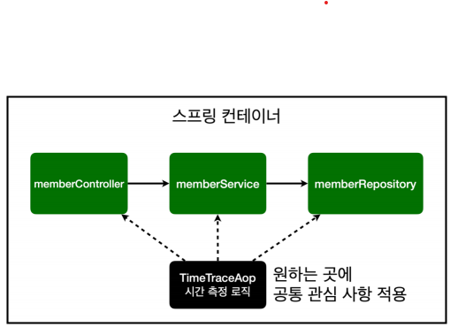
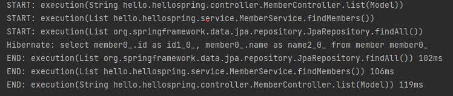
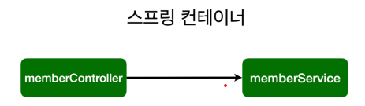
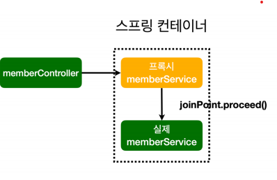
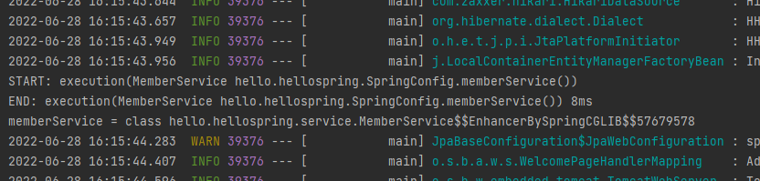
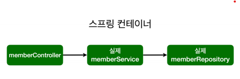
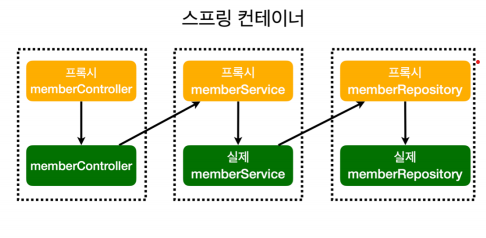

## 11일차 공부(2022.06.28)

# AOP(Aspect Oriented Programming)

## 1. AOP가 필요한 Example
```java
public Long join(Member member){

    long start = System.currentTimeMillis();

    try{
        //같은 이름이 있는 중복 회원X 라고 가정
        validateDuplicateMember(member); //중복 회원 검증

        memberRepository.save(member);
        return member.getId();
    }finally {
        long finish = System.currentTimeMillis();
        long timeMs = finish - start;
        System.out.println("join = " + timeMs + "ms");
    }

}

```
>#### 만약 위와 같이 회원가입, 회원조회 등등 여러 메서드에서 시간 측정을 해야한다고 가정하고 시간 측정 코드를 추가하였다.
<br/>

### 문제점
>#### 1. 회원가입, 조회 등의 기능에서 시간 측정은 핵심 관심사항 X
>#### 2. 시간 측정 로직은 공통 관심 사항O
>#### 3. 비지니스 로직에 시간 측정 로직이 섞여서 유지보수가 어려움.
>#### 4. 시간을 측정하는 로직을 따로 빼서 공통 로직으로 만들기는 어려움.
>#### 5. 만약 시간측정 로직을 변경해야 하면 하나씩 다 찾아가면서 변경해야 하는 끔찍한 상황이 벌어짐.

## 2. 공통 관심 사항 vs 핵심 관심 사항의 분리
- #### 공통 관심 사항(cross-cutting concern)
- #### 핵심 관심 사항(core concern)

>#### 스프링에서는 위와 같이 공통 관심 사항을 적용가능하도록 기술을 지원한다.

## 3. AOP 사용하여 분리 해보자!

### 1. aop/TimeTraceAop.class
```java
@Aspect
public class TimeTraceAop {

    @Around("execution(* hello.hellospring..*(..))")
    public Object execute(ProceedingJoinPoint joinPoint) throws Throwable{
        long start = System.currentTimeMillis();
        System.out.println("START: " + joinPoint.toString());
        try{
            return joinPoint.proceed(); //메서드를 실행
        }finally {
            long finish = System.currentTimeMillis();
            long timeMs = finish - start;
            System.out.println("END: " + joinPoint.toString() + " " + timeMs + "ms");
        }
    }
}
``` 
>#### **@Aspect**를 붙여줘야 AOP로 사용할 수 있음.
>#### **@Around**를 사용하여 이 메서드를 적용할 클래스를 지정할 수 있다.

### 2. SpringCOnfig.class
```java
@Configuration
public class SpringConfig {

    private final MemberRepository memberRepository;

    @Autowired
    public SpringConfig(MemberRepository memberRepository) {
        this.memberRepository = memberRepository;
    }


    @Bean
    public MemberService memberService(){
        return new MemberService(memberRepository);
    }

    @Bean
    public TimeTraceAop timeTraceAop(){
        return new TimeTraceAop();
    }
}
```
>#### AOP클래스를 Bean으로 등록해줘야 함.
>#### Component Scan방식을 써도 되지만 특별한 클래스 이므로 직접 Bean으로 등록해주는게 좋다.
<br/>


>#### 회원목록을 클릭하여 요청을 보내보면 위와 같이 
>#### Controller, Service, Repository 순으로 시작되고 역으로 종료되고 시간 측정이 된걸 볼 수 있다.
</br>

### 결과
- #### 시간을 측정하는 로직을 별도의 공통 로직으로 만들어 핵심 관심사항과 공통 관심사항을 분리하였다.
- #### 변경하기 편하여 유지보수에 용이하다.
- #### AOP를 적용하기를 원하는 대상을 선택할 수 있다.

## 4. AOP 내부 동작 원리

### (1) AOP 적용 전 의존관계

### (2) AOP 적용 후 의존관계

>#### 스프링이 컨테이너에 빈을 등록할 때 진짜 Spring Bean말고 Proxy(대리, 가짜) Spring Bean을 진짜 앞에 등록해준다. jointPoint로 어떤 실행이 발생하면 그때 진짜 Bean을 호출 해준다.
> 
>#### 실제 컨트롤러가 @Autowired로 Service를 자동 주입받을 때 service.getClass()를 통해 어떤 클래스가 주입되었는지를 확인해볼 때 그냥 MemberService가 아니라 뒤에 $$Enhance~~~ 가 뒤에 붙은 Proxy Service 객체가 주입된 것을 볼 수 있다.
### (3) AOP 적용 전 전체 의존관계

### (4) AOP 적용 후 전체 의존관계


### 이걸 Spring에서는 Proxy방식의 AOP라고 한다.
___

#### 지금까지 스프링 입문 - 코드로 배우는 스프링 부트, 웹 MVC, DB 접근 기술(김영한) 강의를 완강하면서 Spring 전반적인 내용을 알게 되었다.
#### 이제 하나하나씩 디테일을 추가할 차례다.
#### 이어서 스프링 핵심 원리 - 기본편(김영한) 강의를 들으며 스프링의 본질과 객체 지향 어플리케이션의 설계와 아키텍처를 생각할 수 있는 능력을 키우려고 한다.