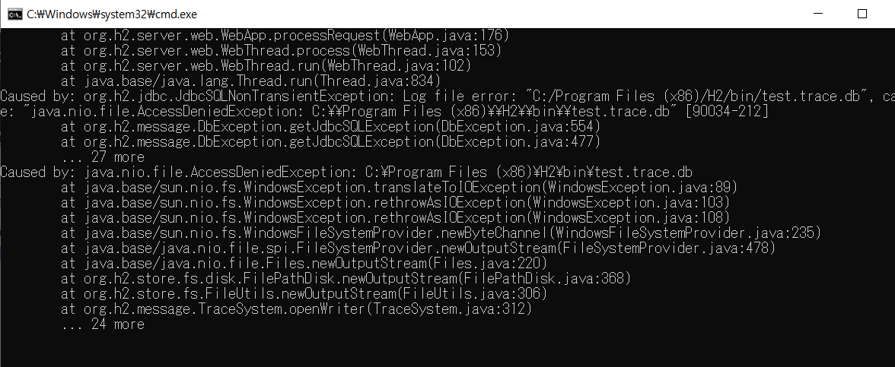
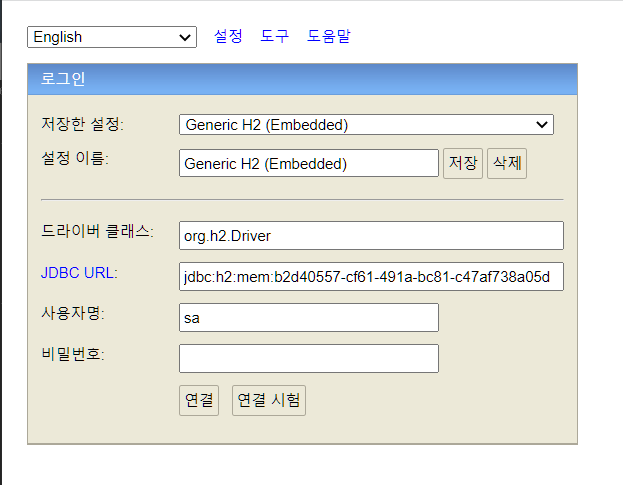
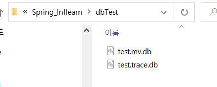
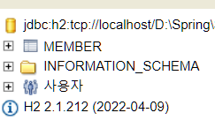

## Spring DB 접근 방법

1. H2 DB
2. Pure JDBC
3. 스프링 JDBCTemplate
4. JPA
5. 스프링 데이터 JPA

# 1. H2 DB

## (1) 설치 및 실행

- [https://www.h2database.com](https://www.h2database.com/) 를 통해 H2를 설치한다.
- **cmd에서 설치한 경로로 들어가서 h2.bat파일을 실행하면(매번 쓸때마다 실행해야 함!)**
  

아래와 같이 새로운 cmd창이 나오면서 h2를 연결할 수 있는 창도 같이 나옴





이러한 창이 나온다!

### 최초에 DB 파일 생성 및 접속 방법

1. DB파일이 속해있을 경로+db파일이름을 JDBC URL 부분에 jdbc:h2: 뒤에 입력한다.

ex) jdbc:h2:D:\Spring\Spring_Inflearn\dbTest\test

1. 연결하면 파일 2개가 생성됨



참고) 하지만, 이렇게 파일로 접근하게 되면 어플리케이션이랑 웹 콘솔이 동시에 같이 접근이 안돼서 오류가 날 수 있으므로 jdbc:h2:tcp://localhost/D:\Spring\Spring_Inflearn\dbTest\test 이런식으로 소켓을 통해서 접근하도록 한다!

```java
create table member
(
 id bigint generated by default as identity,
 name varchar(255),
 primary key (id)
);
```

를 넣고 실행하면 테이블이 생성됨



<aside>
☝ 참고로) sql문을 관리하기 위해 프로젝트 root에 sql디렉터리를 만들어서 관리하는 것도 방법임

</aside>
